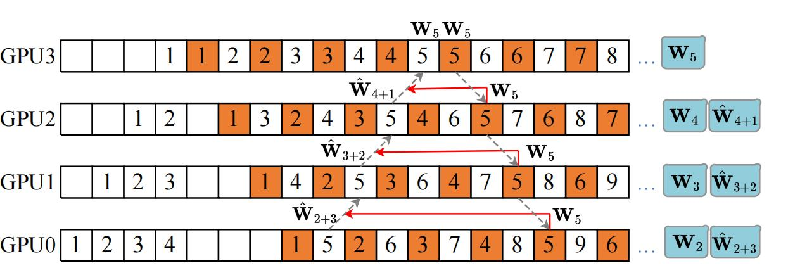
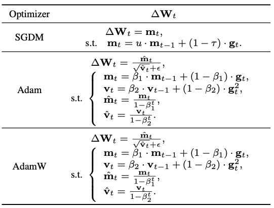
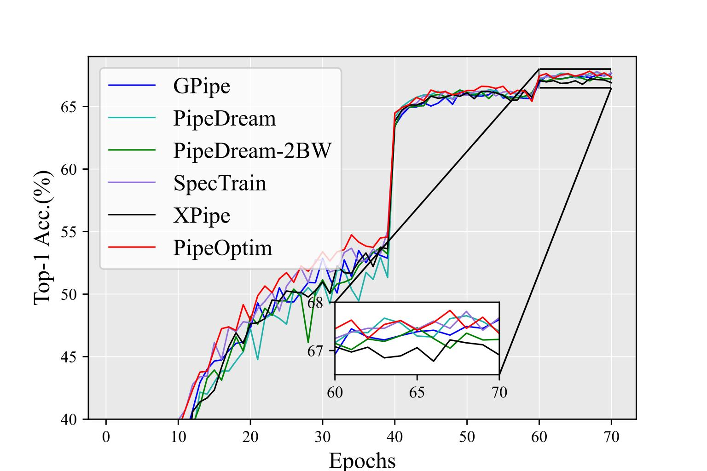
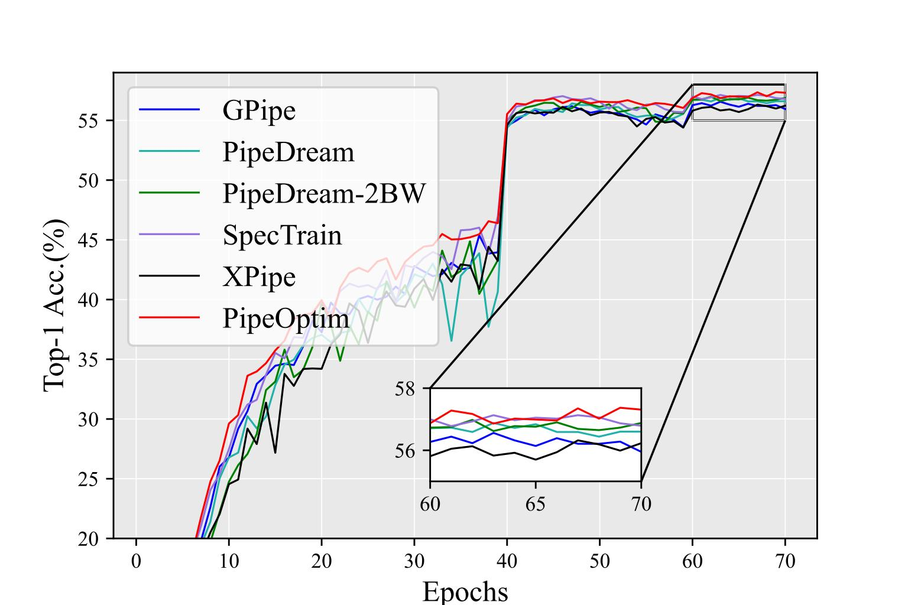

# PipeOptim
A PyTorch implementation of PipeOptim


## Introduction
This is the official implementation of [PipeOptim: Ensuring Effective 1F1B Schedule with Optimizer-Dependent Weight Prediction] (PipeOptim).

This is a PyTorch implementation (based on the source code of [PipeDream](https://github.com/msr-fiddle/pipedream) and [SpecTrain](https://github.com/ntueclab/SpecTrain-PyTorch)).

The following figure describes the main idea of PipeOptim.

<div align="center">

</div>

PipeOptim uses the predicted weights to perform forward pass. The prediction formula for the forward pass is: 
```math
\hat{\mathbf W}_{t+s} = \mathbf W_t - lr \cdot s \cdot\Delta \mathbf{W}_{t},
```
where $lr$ is the learning rate, $s$ denotes the weight version difference, and $\Delta \mathbf{W}_{t}$ are computed based on the update rule of the used optimizer.

PipeOptim lets each GPU compute $s$ via
```math
	s= D -rank -1, 
```
where $D$ refers to the pipeline depth and $rank$ is the index of a stage with $rank \in \{0, 1, \dots, size-1\}$.

PipeOptim computes $\Delta \mathbf{W}_{t}$ according to the update rule of the used optimizer. For Momentum SGD, Adam, and AdamW, $\Delta \mathbf{W}_{t}$ is computed by
<div align="center">

</div>


## Environmental Setup
The experiment settings are the same as [PipeDream](https://github.com/msr-fiddle/pipedream).


## Quick Start
### Image Classification
[from PipeOptim/image_classification; run on 4 GPUs (including a single server with 4 GPUs)]
```bash
python main_with_runtime.py --module models.resnet101.gpus=4 -b 64 --data_dir <path to ImageNet> --config_path models/resnet101/gpus=4/mp_conf.json --distributed_backend gloo --master_addr $MASTER_ADDR  --lr $LR  --print-freq 200  --lr_policy step --rank 0 --local_rank 0 --world_size 4  
python main_with_runtime.py --module models.resnet101.gpus=4 -b 64 --data_dir <path to ImageNet> --config_path models/resnet101/gpus=4/mp_conf.json --distributed_backend gloo --master_addr $MASTER_ADDR  --lr $LR  --print-freq 200 --lr_policy step --rank 1 --local_rank 1 --world_size 4  
python main_with_runtime.py --module models.resnet101.gpus=4 -b 64 --data_dir <path to ImageNet> --config_path models/resnet101/gpus=4/mp_conf.json --distributed_backend gloo --master_addr $MASTER_ADDR  --lr $LR  --print-freq 200  --lr_policy step --rank 2 --local_rank 2 --world_size 4 
python main_with_runtime.py --module models.resnet101.gpus=4 -b 64 --data_dir <path to ImageNet> --config_path models/resnet101/gpus=4/mp_conf.json --distributed_backend gloo --master_addr $MASTER_ADDR --lr $LR  --print-freq 200  --lr_policy step --rank 3 --local_rank 3 --world_size 4
```

Alternatively, one can execute the following scripts.
```bash
cd PipeOptim/image_classification
bash scripts/resnet/pipeoptim_v1.sh
```
### Translation
[from PipeOptim/translation; run on 4 GPUs (including a single server with 4 GPUs)]
```bash
python main_with_runtime.py --data_dir <path to WMT-16> --module models.gnmt.gpus=4 --config_path models/gnmt/gpus=4/mp_conf.json  --master_addr localhost  --distributed_backend gloo --lr 0.0003 -b 64   --print-freq 200 --checkpoint_dir ./checkpoint_dir --recompute --partitions 1 --rank 0 --local_rank 0 
python main_with_runtime.py --data_dir <path to WMT-16> --module models.gnmt.gpus=4 --config_path models/gnmt/gpus=4/mp_conf.json  --master_addr localhost  --distributed_backend gloo --lr 0.0003 -b 64   --print-freq 200 --checkpoint_dir ./checkpoint_dir --recompute --partitions 1 --rank 1 --local_rank 1 
python main_with_runtime.py --data_dir <path to WMT-16> --module models.gnmt.gpus=4 --config_path models/gnmt/gpus=4/mp_conf.json  --master_addr localhost  --distributed_backend gloo --lr 0.0003 -b 64   --print-freq 200 --checkpoint_dir ./checkpoint_dir --recompute --partitions 1 --rank 2 --local_rank 2 
python main_with_runtime.py --data_dir <path to WMT-16> --module models.gnmt.gpus=4 --config_path models/gnmt/gpus=4/mp_conf.json  --master_addr localhost  --distributed_backend gloo --lr 0.0003 -b 64   --print-freq 200 --checkpoint_dir ./checkpoint_dir --recompute --partitions 1 --rank 3 --local_rank 3
```

Alternatively, one can execute the following scripts.
```bash
cd PipeOptim/translation
bash scripts/gnmt8/pipeoptim_adam.sh
```

## Environmental Results
When training ResNet-101 (up) and Inception-V3 (down) on Tiny-Imagenet with SGDM, the experimental results are:
<center class="half">
     
     
</center>

## License
Copyright (c) Lei Guan, Dongsheng Li, Yongle Chen, Jiye Liang, Wenjian Wang, Xicheng Lu. All rights reserved.
Licensed under the [MIT](LICENSE.txt) license.
