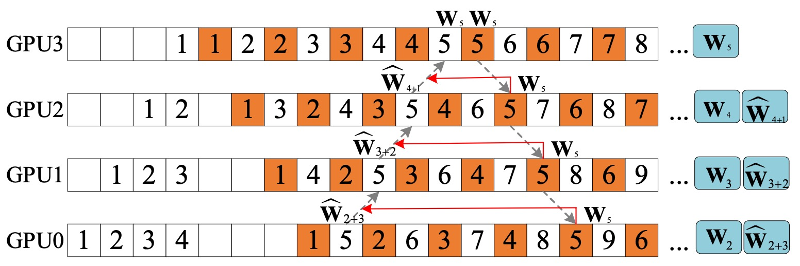

# PipeOptim
A PyTorch implementation of PipeOptim


## Introduction
This is the official implementation of [PipeOptim: Ensuring Effective 1F1B Schedule with Optimizer-Dependent Weight Prediction] (PipeOptim).

This is a PyTroch implementation (based on the source code of [PipeDream](https://github.com/msr-fiddle/pipedream) and [SpecTrain](https://github.com/ntueclab/SpecTrain-PyTorch)).

PipeOptim uses the predicted weights to perform forward. The prediction formula for the forward pass is: 

$\hat{\mathbf W}_t$

<div align="center">

</div>

## Environmental Setup
The experiment settings are the same as [PipeDream](https://github.com/msr-fiddle/pipedream).

## Quick Start
```bash
cd PipeOptim/image_classification
bash scripts/resnet/pipeoptim.sh
```


## License
Copyright (c) Lei Guan, Dongsheng Li, Jiye Liang, Wenjian Wang, Xicheng Lu. All rights reserved.
Licensed under the [MIT](LICENSE.txt) license.
